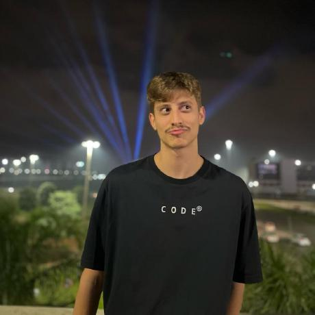
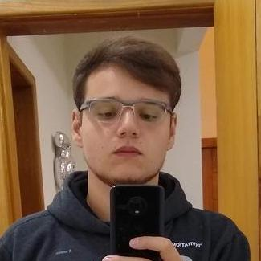
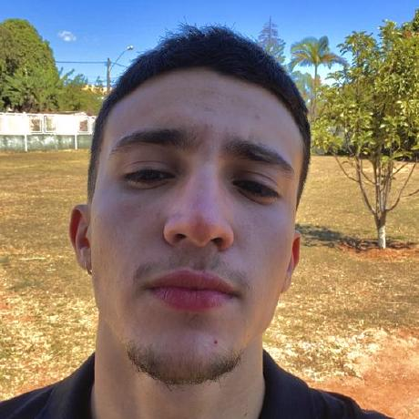
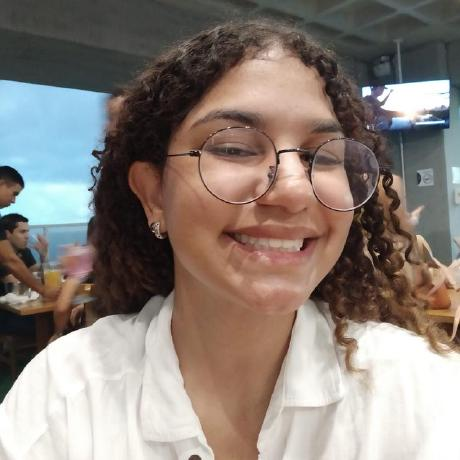
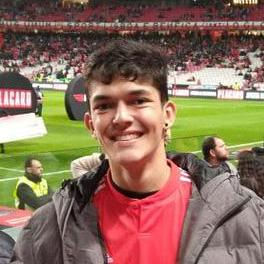
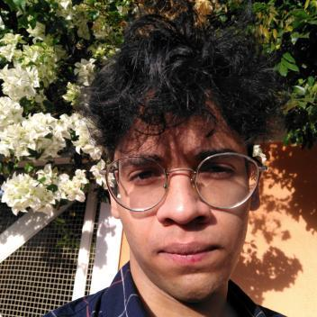
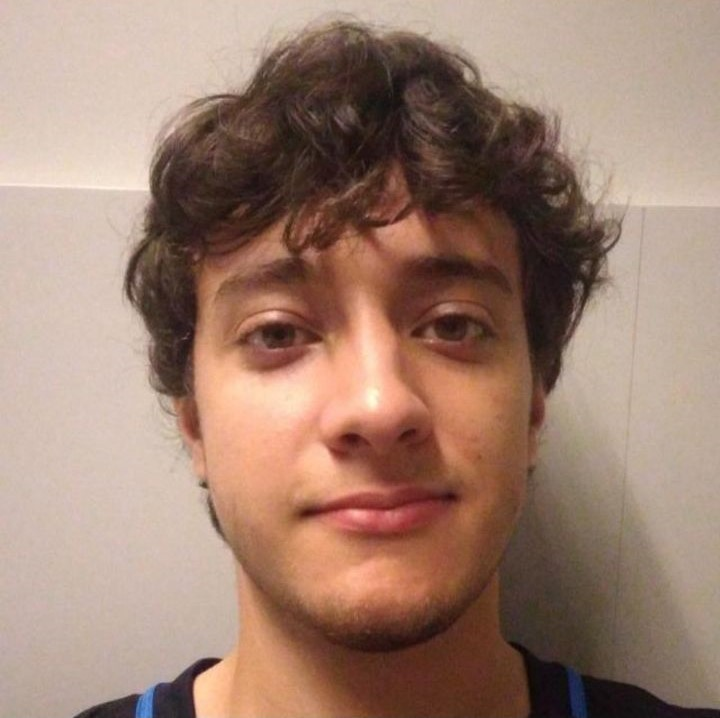

    <h1 class="title">VLC Media Player</h1>
    
O <a href="https://www.videolan.org/">VLC Media Player</a> é um software open source e gratuito que permite a reprodução de vários formatos de mídia. Nessa documentação, estão dispostos os artefatos produzidos no decorrer da disciplina de Interação Humano Computador da Universidade de Brasília (UnB). O objetivo principal deste projeto é realizar pesquisas com os usuários sobre o aplicativo, além de planejar como ele poderia ser melhorado.

    <h2 class="title">Contribuidores</h1>
    

        

            
        

        

            <h3 class="title1">Bruno Ribeiro</h1>
            <a class="hyperlink" href="https://github.com/BrunoRiibeiro">https://github.com/BrunoRiibeiro</a>
        

        

            
        

        

            <h3 class="title1">Giovanni Alvissus</h1>
            <a class="hyperlink" href="https://github.com/giovanni1106">https://github.com/giovanni1106</a>
        

        

            
        

        

            <h3 class="title1">Igor Penha</h1>
            <a class="hyperlink" href="https://github.com/igorpenhaa">https://github.com/igorpenhaa</a>
        

        

            
        

        

            <h3 class="title1">Larissa Gomes</h1>
            <a class="hyperlink" href="https://github.com/larigs">https://github.com/larigs</a>
        

        

            
        

        

            <h3 class="title1">Lucas Gobbi</h1>
            <a class="hyperlink" href="https://github.com/LucasBergholz">https://github.com/LucasBergholz</a>
        

        

            
        

        

            <h3 class="title1">Mizael Santos</h1>
            <a class="hyperlink" href="https://github.com/frmiza">https://github.com/frmiza</a>
        

        

            
        

        

            <h3 class="title1">Rafael Bosi</h1>
            <a class="hyperlink" href="https://github.com/StrangeUnit28">https://github.com/StrangeUnit28</a>
        

    

## Histórico de Versões

| 
Data
 | 
Versão
 | 
Descrição
 | 
Autor(es)
 | 
Data de revisão
 | 
Revisor(es)
 |
| :--:       | :----: | :-------: | :---: | :-------------: | :-----: |
| 19/04/2023 | `1.0`  | Criação da GitPage | [Larissa Gomes](https://github.com/larigs)  |    22/04/2023     | [Giovanni Alvissus](https://github.com/giovanni1106) |
| 22/04/2023 | `1.1`    | Criação botão de contraste de cores |  [Larissa Gomes](https://github.com/larigs)  |    22/04/2023     | [Lucas Gobbi](https://github.com/LucasBergholz) |

